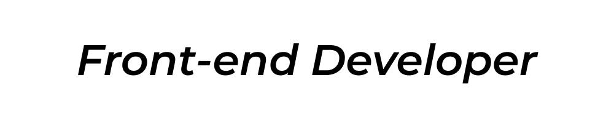

💻 [프로그래밍언어] JavaScript, TypeScript, HTML / CSS

🖼 [프레임워크 & 라이브러리] React, Redux, Redux-Saga, SCSS, Styled-Components

📚 [사용 경험이 있는 스택] Node.js, Koa, MongoDB, Express, MYSQL, Sequelize, AWS(S3, EC2, RDS)

👨‍💻 [협업 툴] Github, Zeplin, Notion, Slack, Trello

🎨 [디자인 툴] Adobe Tool, ProtoPie, Sketch, Figma
